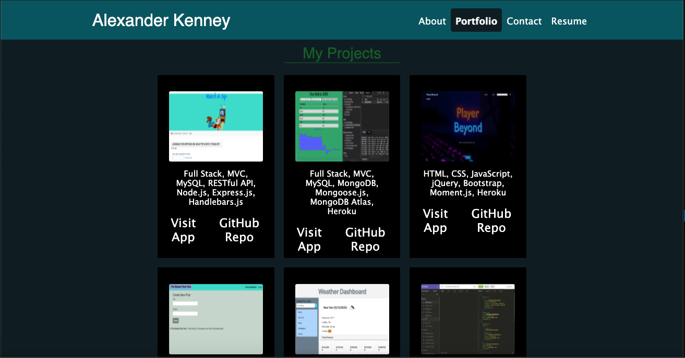

# My Portfolio

## Description
A persoanl portfolio I created to display the projects I created as well as the skills I've learned in my web development journey. This portfolio includes links to my Resume, LinkedIn, Github, and Stack Overflow. 
This single page appliaction was build using React with moble-frist design.

This project was bootstrapped with [Create React App](https://github.com/facebook/create-react-app).

  ## Table of Contents
  - [Tech Used](#tech-used)
  - [Contact](#contact)
  - [Links](#links)

#### About Me Section:

#### Portfolio Section:

#### Contact Section

#### Resume Section:

## Technology Used
  

</a>
<a href='https://nodejs.org/en/'>

## Contact
Please visit my **[GitHub profile](https://github.com/Aken00/)** to check out this and other projects I've created and contributed to.
Contact me at **Ajken04@gmail.com** with any questions or if you'd like to collaborate.

## Links
- **[Deployed App]()**
- **[GitHub Repo](https://github.com/Aken00/portfolio-react-ak)**
- **[My Portfolio]()**

## Credits
- **[React](https://reactjs.org/)**

